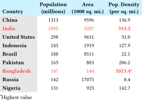
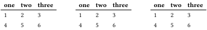
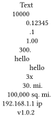
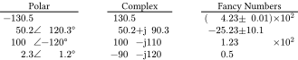
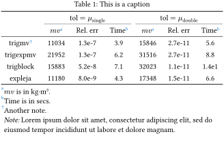
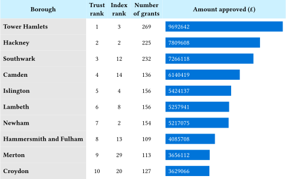

# `tblr` — Table generation and alignment helpers for Typst

`tblr` provides helper functions to better control table formatting.
`tblr` was inspired by the LaTeX
[Tabularray](https://ctan.org/pkg/tabularray) package. Like Tabularray,
table formatting can be specified with directives, so the formatting can
be separate from table entries. You can also continue to use cell-level
formatting, too.

Here is an example:



```typ
#import "@preview/tblr:{version}": *
{population}
```


## API

### `tblr`

```typ
#tblr(header-rows: 0, caption: none, placement: auto, remarks: none, table-fun: table, ..args)
```

`tblr` is the main function for table creation that supports several
helper functions.

Returns a Typst `table`.

Normal table arguments like `columns`, `fill`, `gutter`,
`table.hline`, and cell contents are passed to the `table` function.

Other arguments can be special directives to control formatting.
These include `cells()`, `cols()`, `rows()`, `hline()`, ...
 
Named arguments specific to `tblr` include:

* `header-rows` (default: auto): Number of header rows in the content. `auto` means determine number from header rows provided with content, otherwise zero.
* `remarks`: Content to include as a comment below the table.
* `caption`: If provided, wrap the `table` in a `figure`.
* `placement` (default: `auto`): Passed to `figure`.
* `content-hook` (default: `none`): Transform the input data to `table`-compatible cell content.
* `table-fun` (default: `table`): Specifies the table-creation function to use.
* `note-numbering` (default: "a"): Numbering for table notes.
* `note-fun` (default: `super`): Formatting function for note indicators. 
* `ret`: If provided, `tblr` returns a dictionary with 
components. Options include:
  * "components": includes "table", "remarks", and more.
  * "arguments": as above but includes arguments passed to `table-fun`.

  Because `ret` relies on internals, it is not guaranteed to be stable
  with version changes.

### `cells` and other special formatting directives

`cells` is a directive to control formatting of cells. Positional
arguments can be one or more row and column indicators or special types.
The named argument `within` applies row ranges to "header" or "body" if
supplied.

Each indicator is specified by a `(row, col)` array pair.
Each `row` and `col` can be an integer or array of integers or indicators.

Accepted indicators include:

* Positive integers: normal row/column indicators starting at 0.
* `end`: the last row or column.
* `auto`: all rows or columns.
* Negative integers: indexing from the end; -1 is the last row/column.
* `span(to)` or `span(from, to)`: ranges of rows or columns. Note that the `to` argument to `span` is different than the `to` argument for `range`. With `span`, the `to` argument is inclusive. `span(2, end)` includes the last row/column.
* A function that returns a boolean indicating whether to include the row or column; commonly `calc.even` or `calc.odd` to select alternating rows or columns.

Named arguments are passed to cells. These include normal arguments like
`fill` and `colspan`.

Special arguments include directives that specify further processing.
These include:

* `hooks`: apply the given function to the cell content. Can also be an
  array of functions to apply sequentially.

Variations of `cells` include the following functions:

* `cols`: Control formatting of columns. Normal positional arguments
  are one or more column indicators. All rows are included.
* `rows`: Control formatting of rows. Normal positional arguments
  are one or more row indicators. All columns are included.

A directive is available to add table notes. `note` is a function with
positional arguments. Notes are positioned at the bottom of the table
before remarks. Arguments given as arrays indicating which cells to
apply the note to (same format as `cells`). If one argument positional
argument has content, it's taken as the body of the note. If two
positional arguments have content, the first is the marker for the note,
and the second is the body of the note.

Several directives are available to control horizontal and vertical
lines. These are like `table.hline` and `table.vline`, but they can
include directives like `end`.

* `hline` -- also takes a `within` argument to apply to "header" or
  "body".
* `vline`

Another special directive function is `apply` which applies a function
to columns of a matrix. The function supplied will receive a
one-dimensional array and should return a one-dimensional array of the
same size. The function is supplied as the last positional argument. It
accepts a `within` argument of "body" to apply only to the columns in
the body of the table. Like `cells`, each positional argument is a
`(row, col)` array pair, and normal positional indicators can be used.
`col-apply` is a version of apply where each positional argument is a
column indicator.
  
Note that the order of formatting directives matters. These are
processed in reverse order, so later entries override earlier entries.

### Data Utilities

```typ
#from-csv(x, delimiter: ",", flatten: true, trim: true, evaluate: false)
```
Converts string `x` into an arguments type that includes an array plus
a named argument `columns`. This is a thin wrapper over
`csv.decode`. Options include:
- `delimiter`: default: ","
- `flatten`: default: `true`: Flatten the result.
- `trim`: default: `true`: Trim each string.
- `evaluate`: default: `false`: `eval` each string to convert each to content.

```typ
#from-dataframe(df, include-header: true)
```
Convert `df` from a dataframe to a flat array plus a named argument `columns`
suitable to passing to
`table`. `df` is expected to be a dictionary in dataframe style where
each component is a columnar array. If `include-headers` is `true`, the
keys of the dictionary are included on the first row of the table
returned. 

These data utilities can be used wih `tblr` using the `content-hook`
option. The following shows different ways to create the same table.



```typ
#import "@preview/tblr:{version}": *
{inputs}
```

The last example shows row-oriented input using the
[rowmantic](https://github.com/typst-community/rowmantic) package.
It may be possible to use other table packages in a similar fashion. 

### Decimal Alignment

```typ
#decimal-align(a, decimal: regex("\.\d"), marker: "&", other-align: center)
```

`decimal-align` takes an array `a` and returns an array with contents
aligned. Rules mostly follow
[tbl](https://typst.app/universe/package/tbl/):
- One position after the leftmost occurrence of the non-printing
  input token `marker` (default: `&`), if any is present.
- Otherwise, the rightmost occurrence of the `decimal`. Defaults to
  `.` just before a digit.
- Otherwise, the rightmost digit.
- Otherwise, the content is aligned using `other-align` (default:
  `center`).

Alignment tries to work with formatted content and not just strings.
That means it should work with footnotes, basic formatting, and basic
equations. This is tricky, so there are probably bugs.

Note that `decimal-align` needs to be used in a context. Common usage is
to apply that to `tblr` and use `decimal-align` with `apply`. Note that
the `apply` directive must come after other formatting directives. That
means it is applied first before any of the other formatting directives,
and the contents are still strings.

Here is an example:



```typ
#import "@preview/tblr:{version}": *
{decimalalign}
```


### General Alignment Utilities

```typ
#split-and-align(x, format: (), align: ())
```
Given an array of content `x`, split it according to `format`, and then
align them based on `align`. 
* `format`: an array of regex strings. Each string is the point at which
  the content is split (on the right side of the regex).  
  Each of these splits `x` sequentially from left to right.
  If the regex doesn't match, the "cell" is left blank, and matching
  continues with the next regex.
* `align` is an array of `left` or `right` designations for each
  component. The length of `align` should be one longer than the length
  of `format`.

`split-and-align` must be used in a context. This function will traverse
into content, including equations. If the content has contexts, the
splitting will not work with that.

Here is an example. It also shows usage of `from-dataframe`.



```typ
#import "@preview/tblr:{version}": *
{generalalign}
```

## HTML/EPUB Support

`tblr` has basic support for HTML tables. The alignment utilities support HTML. Alignment in tables is clunky in HTML, but the approach used here to split cells and apply some CSS seems to work well enough.
For an example, see [here](https://github.com/tshort/tblr/blob/master/examples/html/align-html.typ). See [this HTML](https://tshort.github.io/bene/align-html.html) and [this EPUB](https://tshort.github.io/bene/?preload=align-html.epub) for results.  
Both were generated by [Rheo](https://rheo.ohrg.org/).
For the alignment to work, CSS styling needs to be added as shown in this example.

None of the formatting directives in tables currently work. Styling with CSS will be needed.

## More Examples

### Booktabs

This example tries to mimic [booktabs](https://ctan.org/pkg/booktabs).
Replicating booktabs with Typst tables is a bit fiddly. `table.hline`
works fine, but adjusting the spacings between rule locations and rows
is tough. It'd be great to have [this
feature](https://github.com/typst/typst/issues/4743) to adjust spacing
around `hlines`. The approach below adjusts insets to make the spacing
between rows nicer. The `column-gutter` is needed for
separation of the rules between the two column blocks. This example also 
shows the use of `caption`, `remarks`, and `note`.



```typ
#import "@preview/tblr:{version}": *
{booktabs}
```

The approach above is a bit cumbersome, but the formatting directives
can be used as part of a wrapper function if you want to create many
tables with a booktabs style. Here's an example:

```typ
#let booktbl = tblr.with(
  stroke: none,
  column-gutter: 0.6em,
  // booktabs style rules
  rows(within: "header", auto, inset: (y: 0.5em)),
  rows(within: "header", auto, align: center),
  hline(within: "header", y: 0, stroke: 0.08em),
  hline(within: "header", y: end, position: bottom, stroke: 0.05em),
  rows(within: "body", 0, inset: (top: 0.5em)),
  hline(y: end, position: bottom, stroke: 0.08em),
  rows(end, inset: (bottom: 0.5em)),
)
```

### Graphical Styling

This example shows use of a custom function to add some graphical
styling to one of the columns of a table. Adapted from
[here](https://www.storytellingwithdata.com/blog/2012/02/grables-and-taphs). It also shows including passing in a `table.header` with `header-rows` defaulting to `auto`.



```typ
#import "@preview/tblr:{version}": *
{grantspend}
```


## Changelog

### v0.4.1

* Bug fix where `content-hook` results overrode user-entered arguments.

### v0.4.0

* Added the `content-hook` option to `tblr`.
* Renamed `dataframe-to-table` to `from-dataframe` (breaking).
* Changed `from-csv` and `from-dataframe` to return an argument type with a `columns` argument (breaking).

### v0.3.2

* Updates for Typst v0.13.

### v0.3.1

* Bug fixes.

### v0.3.0

* Add `note` for table notes.
* Improve decimal alignment to work with notes and other formatting.
* Add general alignment utilities, including `split-and-align`.
* Add data utilities `from-csv` and `dataframe-to-table`.
* Add `ret` option to `tblr` to allow returning components.
* Add tests.

### v0.2.0

* Remove functions like `body-cells`. Use `cells(within: "body"...)` instead.
* Add `apply` and `col-apply`to apply a function column wise.
* Fix a bug in span on the `to` argument.
* Add `decimal-align` to align on decimals.
* Change the default in `header-rows` to `auto`. Traverse into headers provided with content. 

### v0.1.0

* Initial release
