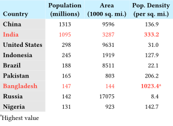
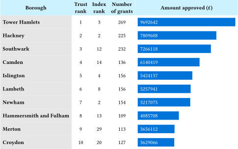
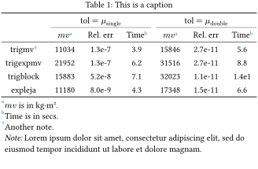
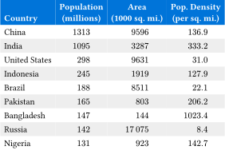

# `tblr` — Table generation helpers for Typst

`tblr` provides helper functions to better control table formatting.
`tblr` was inspired by the LaTeX
[Tabularray](https://ctan.org/pkg/tabularray) package. Like Tabularray,
table formatting can be specified with directives, so the formatting can
be separate from table entries. You can also continue to use cell-level formatting, too.

Here is an example:



```typ
#import "@preview/tblr:0.2.0": *

#let pop = csv.decode("
China,1313,9596,136.9
India,1095,3287,333.2
United States,298,9631,31.0
Indonesia,245,1919,127.9
Brazil,188,8511,22.1
Pakistan,165,803,206.2
Bangladesh,147,144,1023.4
Russia,142,17075,8.4
Nigeria,131,923,142.7"
).flatten()

#set table(stroke: none)

#tblr(header-rows: 1, columns: 4,
  align: (left+bottom, center, center, center),
  // formatting directives
  rows(within: "header", 0, fill: aqua.lighten(60%), hooks: strong),
  cols(within: "body", 0, fill: gray.lighten(70%), hooks: strong),
  rows(within: "body", 1, 6, hooks: text.with(red)),
  cells(((2, -3), end), hooks: strong),
  // content
  [Country], [Population \ (millions)],[Area\ (1000 sq. mi.)],[Pop. Density\ (per sq. mi.)],
  ..pop
)
```


## API

### `tblr`

`tblr` is the main wrapper for table creation that supports several
helper functions.

Returns a Typst `table`.

Normal table arguments like `columns`, `fill`, `gutter`,
`table.hline`, and cell contents are passed to the `table` function.

Other arguments can be special directives to control formatting.
These include `cells()`, `cols()`, `rows()`, `header-rows()`, ...
 
Named arguments specific to `tblr` include:

* `header-rows` (default: 0): Number of header rows in the content.
* `remarks`: Content to include as a comment below the table.
* `caption`: If provided, wrap the `table` in a `figure`.
* `placement` (default: `auto`): Passed to `figure`.
* `table-fun` (default: `table`): Specifies the table-creation function to use.
* `within`: apply row ranges to "header" or "body" if supplied.

### `cells` and other special formatting directives

`cells` is a directive to control formatting of cells. Positional
arguments can be one or more row and column indicators or special types. 

Each indicator is specified by a `(row,col)` array pair.
Each `row` and `col` can be an integer or array of integers or indicators.

Accepted indicators include:

* Positive integers: normal row/column indicators starting at 0.
* `end`: the last row or column.
* `auto`: all rows or columns.
* Negative integers: indexing from the end; -1 is the last row/column.
* `span(to)` or `span(from, to)`: ranges of rows or columns. Note that the `to` argument to `span` is different than the `to` argument for `range`. With `span`, the `to` argument is inclusive. `span(2, end)` includes the last row/column.
* A function that returns a boolean indicating whether to include the row or column; commonly `calc.even` or `calc.odd` to select alternating rows or columns.

Named arguments are passed to cells. These include normal arguments like
`fill` and `colspan`.

Special arguments include directives that specify further processing.
These include:

* `hooks`: apply the given function to the cell content.

Other variations of `cells` include:

* `cols`: Control formatting of columns. Normal positional arguments
  are one or more column indicators.
* `rows`: Control formatting of rows. Normal positional arguments
  are one or more row indicators.

Several directives are available to control horizontal and vertical
lines. These are like `table.hline` and `table.vline`, but they can
include directives like `end`.

* `hline`
* `header-hline`: like `hline`, but relative to the header.
* `vline`

Another special directive is `apply` which can apply a function to
columns of a matrix. It accepts a `within` argument of "body" to apply
only to the columns in the body of the table.

Note that the order of formatting directions matters. These are
processed in reverse order, so later entries override earlier entries.

## More Examples

This example shows use of a custom function to add some graphical 
styling to one of the columns of a table. 
Adapted from [here](https://www.storytellingwithdata.com/blog/2012/02/grables-and-taphs).



```typ
#import "@preview/tblr:0.2.0": *

#let data = csv.decode("
Tower Hamlets,1,3,269,9692642
Hackney,2,2,225,7809608
Southwark,3,12,232,7266118
Camden,4,14,136,6140419
Islington,5,4,156,5424137
Lambeth,6,8,156,5257941
Newham,7,2,154,5217075
Hammersmith and Fulham,8,13,109,4085708
Merton,9,29,113,3656112
Croydon,10,20,127,3629066
").flatten()

#set table(stroke: none)

#let bar(x) = {
  rect(width: int(x) / 7000000 * 2in, fill: blue, text(fill: white, x))
}

#tblr(header-rows: 1, columns: 5,
  align: center+horizon,
  // formatting directives
  rows(within: "header", 0, fill: aqua.lighten(60%), hooks: strong),
  cols(within: "body", 0, align: left, fill: gray.lighten(70%), hooks: strong),
  cols(within: "body", -1, align: left, hooks: bar),
  // content
  [Borough],[Trust\ rank],[Index\ rank],[Number\ of grants],[Amount approved (£)],
  ..data
)
```

This example tries to mimic [booktabs](https://ctan.org/pkg/booktabs).
Replicating booktabs with Typst tables is a bit fiddly. `table.hline`
works fine, but adjusting the spacings between rule locations and rows
is tough. It'd be great to have [this
feature](https://github.com/typst/typst/issues/4743) to adjust spacing
around `hlines`. The approach below adjusts insets to make the spacing
between rows nicer. The `column-gutter` is needed for
separation of the rules between the two column blocks.



```typ
#import "@preview/tblr:0.2.0": *

#tblr(columns: 7, header-rows: 2,
  stroke: none,
  // combine header cells
  cells((0, (1,4)), colspan: 3, stroke: (bottom: 0.03em)),
  column-gutter: 0.6em,
  // booktabs style rules
  rows(within: "header", auto, inset: (y: 0.5em)),
  rows(within: "header", auto, align: center),
  hline(within: "header", y: 0, stroke: 0.08em),
  hline(within: "header", y: end, position: bottom, stroke: 0.05em),
  rows(within: "body", 0, inset: (top: 0.5em)),
  hline(y: end, position: bottom, stroke: 0.08em),
  rows(end, inset: (bottom: 0.5em)),
  // table note and caption
  remarks: [Note: ] + lorem(18),
  caption: [This is a caption],
  // content
  [], [tol $= mu_"single"$], [], [], [tol $= mu_"double"$], [], [],
  [], [$m v$ ], [Rel.~err], [Time   ], [$m v$ ], [Rel.~err], [Time], 
  [trigmv   ],  [11034], [1.3e-7], [3.9], [15846], [2.7e-11], [5.6 ], 
  [trigexpmv], [21952], [1.3e-7], [6.2], [31516], [2.7e-11], [8.8 ], 
  [trigblock], [15883], [5.2e-8], [7.1], [32023], [1.1e-11], [1.4e1], 
  [expleja  ], [11180], [8.0e-9], [4.3], [17348], [1.5e-11], [6.6 ])
 ```

The approach above is a bit cumbersome, but the formatting directives
can be used as part of a wrapper function if you want to create many
tables with a booktabs style. Here's an example:

```typ
#let booktbl = tblr.with(
  stroke: none,
  column-gutter: 9pt,
  // booktabs style rules
  rows(within: "header", auto, inset: (y: 7pt)),
  rows(within: "header", auto, align: center),
  hline(within: "header", y: 0, stroke: 0.08em),
  hline(within: "header", y: end, position: bottom, stroke: 0.05em),
  rows(within: "body", 0, inset: (top: 9pt)),
  hline(y: end, position: bottom, stroke: 0.08em),
  rows(end, inset: (bottom: 9pt)),
)
```

Here is an example of the first table with decimal alignment provided by
the [zero](https://typst.app/universe/package/zero/) package.
The `format` argument specifies alignment. Note that cell-level
text formatting can mess up decimal alignment, so I had to take out 
the red text highlights on two rows. This example also highlights the
use of a function indicator to select alternating rows and using more than one hook function for the header.



```typ
#import "@preview/zero:0.3.0": ztable

#let pop = csv.decode("
China,1313,9596,136.9
India,1095,3287,333.2
United States,298,9631,31.0
Indonesia,245,1919,127.9
Brazil,188,8511,22.1
Pakistan,165,803,206.2
Bangladesh,147,144,1023.4
Russia,142,17075,8.4
Nigeria,131,923,142.7"
).flatten()

#set table(stroke: none)

#tblr(header-rows: 1, columns: 4,
  table-fun: ztable,
  align: (left+bottom, center, center, center),
  // ztable formatting
  format: (none, auto, auto, auto),
  // formatting directives
  rows(within: "header", 0, fill: blue, hooks: (strong, text.with(white))),
  rows(within: "body", calc.even, fill: gray.lighten(80%)),
  // content
  [Country], [Population \ (millions)],[Area\ (1000 sq. mi.)],[Pop. Density\ (per sq. mi.)],
  ..pop
)
```
